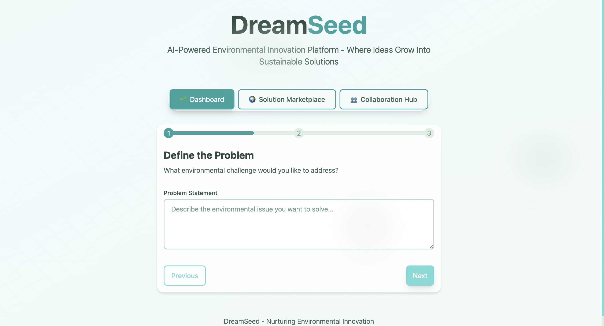
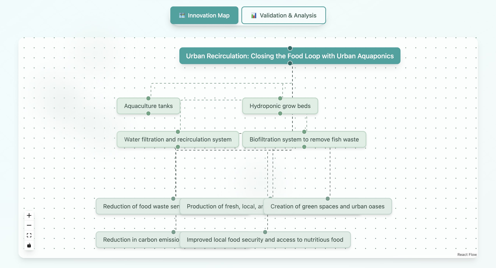
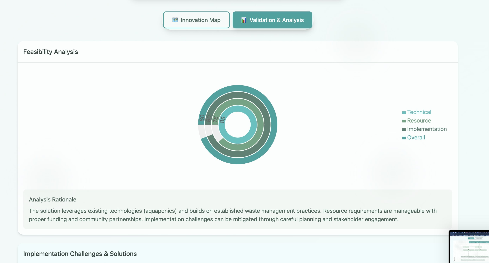
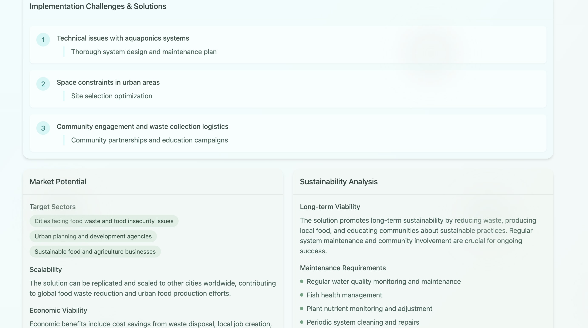
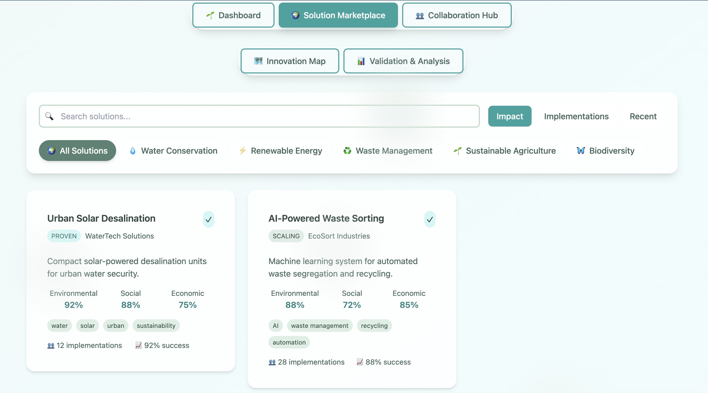
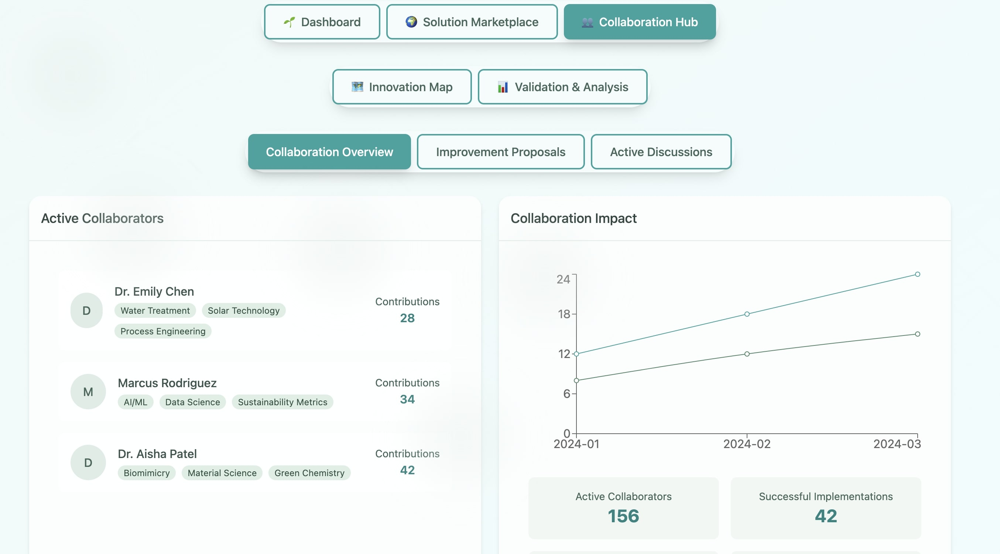

# DreamSeed - AI-Powered Environmental Innovation Platform

DreamSeed is an innovative platform that leverages AI to generate, visualize, and validate environmental solutions. Built for the hackathon, it combines cutting-edge technology with environmental consciousness.

## Features

- AI-powered solution generation using Gemini API
- Interactive visualization of environmental solutions
- Comprehensive validation and feasibility analysis
- Beautiful environmental-themed UI
- Real-time solution generation and analysis

## Tech Stack

- React + TypeScript
- Tailwind CSS
- Framer Motion
- Google Gemini AI
- React Flow
- Zustand

## Getting Started

1. Clone the repository
2. Install dependencies: `npm install`
3. Create a `.env` file with your Gemini API key:
   ```
   VITE_GEMINI_API_KEY=your_api_key_here
   ```
4. Start the development server: `npm run dev`

## Images







[Add documentation links and details]

## License

MIT
